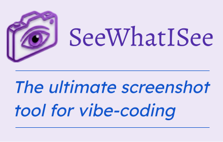
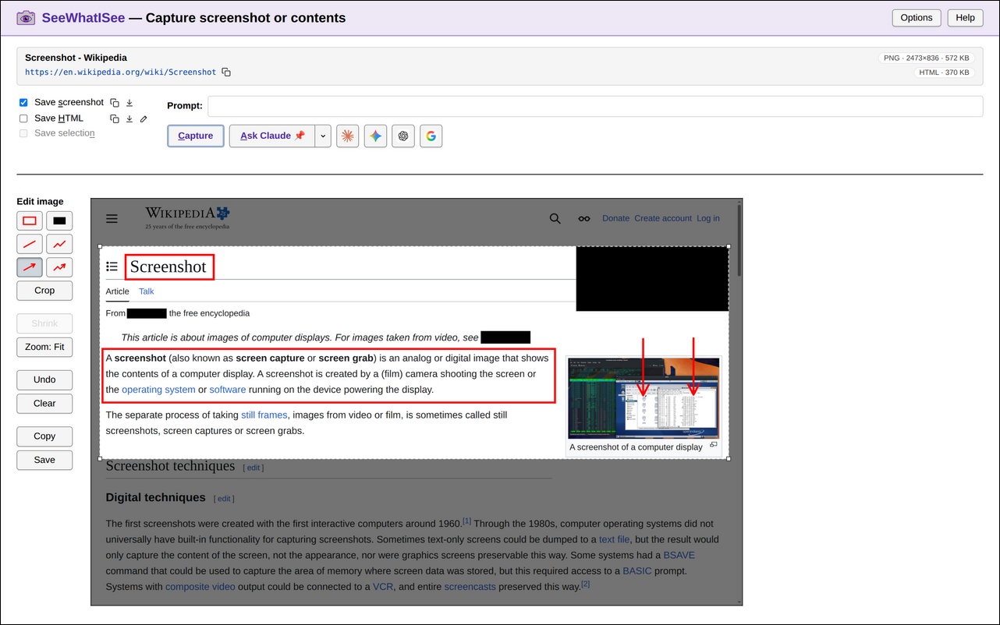

<p></p>

# SeeWhatISee Chrome Extension

Click the toolbar icon to open the *Capture* page. Pick what to send
(screenshot, page HTML, selected text, or just the URL), mark it up
or add a prompt, and ship it to a web chatbot or a CLI agent.

- **Web targets** — *Claude*, *ChatGPT*, *Gemini*, *Google*.
- **CLI targets** — *Claude Code* and *Gemini CLI*, via bundled
  `/see-what-i-see` skills that read captures saved to
  `~/Downloads/SeeWhatISee/`.
- **Markup** — highlight, redact or crop the images.
- **Configurable** — hotkeys, default click and double-click actions,
  default items to save, which web agents to use.

See [Usage](#usage) for the full feature tour, or jump to [Installation](#installation).

The *Capture* page:



## Usage

### Chrome extension

#### Activate SeeWhatISee

- Click the extension icon  to open the *Capture* page.
  - Default hotkey: `Ctrl+Shift+X` (`⌘+Shift+X` on Mac)
- Double-click to save a screenshot (or selected text) immediately.
  - Default hotkey: `Ctrl+Shift+E` (`⌘+Shift+E` on Mac)
- Right-click for more options.
- Right-clicking on an image lets you capture that image directly.

#### Capturing selected text

When text is selected on the page, clicking the icon saves the selection (by default).  You can also save selected text on the *Capture* page.

Text can be saved **as HTML**, **as text**, or **as markdown** (the default).

Saving as markdown uses a lightweight conversion that includes headings, bullets, links, tables, and some simple formatting, converting to a format that's friendly and efficient for both humans and agents to read.

#### *Capture* page

This page allows full control of what's captured.  You can add highlights on the page and **add a prompt telling the agent what you want to do**.

Click **Capture**, the toolbar icon , or press `Enter` in the prompt field to submit.

On this page, you can:

- Choose what to save: **screenshot**, **HTML**, or **selection**.
  - You can preview or edit the HTML or selection text with the pencil icon .
  - Copy the saved filenames to the clipboard with the copy icon .
  - Save to other locations with the download icon .

- Add an optional **Prompt**.
  - `Enter` submits; `Shift+Enter` or `\+Enter` inserts a newline.
  - HTML copied from a web page is converted to markdown during **Paste**.
    - *Paste as plain text* (`Ctrl-Shift-V`) pastes the original copied text.

- Annotate the screenshot with **drawing tools**:
  - Draw **boxes**, **lines** or **arrows**.
  - **Crop** the image by drawing a rectangle, or dragging borders.
  - Use **Redact** to hide parts of image with black boxes.
  - Use **Shrink** to tighten the most recent box or redaction, or the crop region, around its content. This strips whitespace or borders around the outer edges.
  - **Zoom** in or out using the button or mouse wheel.
  - **Undo** or **Clear** to revert edits.
  - **Copy** to clipboard.
  - **Save** to a file.

> [!TIP]
> If you add a prompt, the agent will follow it when reading this snapshot, focusing on highlighted areas in the screenshot.

#### **Ask** buttons — Sending to web chatbots

Click **Ask** to send the selected files and the prompt to one of the chatbots on the web.

Use the drop-down menu to select a target — opening a new tab (↗) or continuing in an existing tab (📌).

Click a provider icon to start a new tab in
- **Claude**; Requires login. Supports **Claude Code** too, but with image uploads only.
- **ChatGPT**; Supports uploading at most two files per prompt.
- **Gemini**; Requires login to upload images.
- **Google**; Does a Google search with the prompt and an uploaded image. Requires login to upload images.

While viewing a chatbot page, the toolbar context menu lets you **Set this tab as the Ask button target**.

> [!TIP]
> Some chatbot providers require an account and that you are logged in. You can change the default and remove unsupported providers on the *Options* page.

#### Options

Open the **Options** page from the toolbar context menu or with the button on the *Capture* page.

You can configure:

- **Ask** button providers — Which web chat provider is the default, and which others show up.
- *Capture* page *Prompt* settings — `Enter` behavior, and whether to *Capture* or *Ask* by default.
- Default items to save — on the Capture page and when you double-click.
- Toolbar icon and context menu 
  - Default actions for *Click* and *Double-click*
  - Hotkeys (set on the Chrome settings page chrome://extensions/shortcuts)

### Claude Code skills

- `/see-what-i-see` — read the latest snapshot and describe it
- `/see-what-i-see-watch` — watch for new snapshots to appear in the background, and then look at them when they appear
- `/see-what-i-see-stop` — stop a running watch loop
- `/see-what-i-see-help` — print a summary of the commands

If you've added a prompt with the snapshot, Claude will follow it.

You can also add prompts after the commands above and they'll be applied
on each snapshot. For example,

- `/see-what-i-see` `What font is the heading on this page?`
- `/see-what-i-see-watch` `Just report the snapshot filenames`

### Gemini CLI commands

- `/see-what-i-see` `[prompt]` — read the latest capture.
- `/see-what-i-see-watch` `[prompt]` — watch for new captures and
  describe each one.
  - Runs in the foreground. (Gemini has no async background worker with a completion callback)
  - The conversation stays paused on a blocking shell call between captures. 
  - Stop it by pressing *Escape*.

## Installation

### Chrome web store

Install from the Chrome web store.  Link pending.

> [!TIP]
> Pin the extension on your toolbar using **Pin to toolbar** on the **Manage extension** page, or using the "Extensions" (puzzle piece) toolbar icon.

### Chrome extension (from a release zip)

1. Download `SeeWhatISee-extension-vX.Y.Z.zip` from the [Releases page](https://github.com/jshute96/SeeWhatISee/releases) and unzip it.
2. In Chrome: open `chrome://extensions`, enable **Developer mode**,
   click **Load unpacked**, and select the unzipped directory.

### Chrome extension (from source)

1. Clone this repo and install dependencies:
   ```bash
   git clone https://github.com/jshute96/SeeWhatISee.git
   cd SeeWhatISee
   npm install
   ```
2. Build the extension:
   ```bash
   npm run build
   ```
3. In Chrome: open `chrome://extensions`, enable **Developer mode**,
   click **Load unpacked**, and select the `dist/` directory.

### Claude Code plugin

Add the marketplace and install the plugin:

```bash
/plugin marketplace add jshute96/SeeWhatISee-claude
/plugin install see-what-i-see@see-what-i-see-marketplace
```

This loads the released version of the Claude plugin from the [SeeWhatISee-claude](https://github.com/jshute96/SeeWhatISee-claude) GitHub repository.

#### Avoiding permission prompts

`/see-what-i-see-watch` may trigger permission prompts when restarting to watch for the next screenshot.

To avoid this, add this to `$HOME/.claude/settings.json`, replacing `HOMEDIR` with your home directory (which is printed in the permission prompt):

```
  "permissions": {
    "allow": [
      "Bash(HOMEDIR/.claude/plugins/cache/see-what-i-see-marketplace/**)",
      "Read(~/Downloads/SeeWhatISee/**)"
    ]
  }
```

`/see-what-i-see-help` also includes this suggestion.

[Issue #2](https://github.com/jshute96/SeeWhatISee/issues/2) is about finding a better workaround to avoid permission prompts.

### Gemini CLI commands

#### Gemini Extension

> [!NOTE]
> The extension is experimental. Install might not work correctly yet in all system configurations.

A Gemini extension is available, packaging the commands as skills. Install by running:

```bash
gemini extensions install https://github.com/jshute96/SeeWhatISee-gemini
```

Add permissions in `$HOME/.gemini/settings.json` to avoid permission prompts:

```
{
  "tools": {
    "allowed": [
      "run_shell_command($HOME/.gemini/extensions/see-what-i-see/skills/see-what-i-see/scripts/copy-last-snapshot.sh)",
      "run_shell_command($HOME/.gemini/extensions/see-what-i-see/skills/see-what-i-see-watch/scripts/watch-and-copy.sh)"
    ]
  }
}
```

#### Manual install

Run `scripts/gemini-install.sh` from inside `gemini`, so it can install into Gemini's sandbox home directory.

```bash
git clone https://github.com/jshute96/SeeWhatISee.git
cd SeeWhatISee
gemini 'Run `scripts/gemini-install.sh`'
```

Alternative: Copy these files into the same directories in your `.gemini` directory:

* [`.gemini/commands/see-what-i-see.toml`](https://github.com/jshute96/SeeWhatISee/blob/main/.gemini/commands/see-what-i-see.toml)
* [`.gemini/commands/see-what-i-see-watch.toml`](https://github.com/jshute96/SeeWhatISee/blob/main/.gemini/commands/see-what-i-see-watch.toml)
* [`.gemini/scripts/_common.sh`](https://github.com/jshute96/SeeWhatISee/blob/main/.gemini/scripts/_common.sh)
* [`.gemini/scripts/copy-last-snapshot.sh`](https://github.com/jshute96/SeeWhatISee/blob/main/.gemini/scripts/copy-last-snapshot.sh)
* [`.gemini/scripts/watch-and-copy.sh`](https://github.com/jshute96/SeeWhatISee/blob/main/.gemini/scripts/watch-and-copy.sh)

## Output files

Everything the extension writes lands under
`~/Downloads/SeeWhatISee/`. A capture produces one or more capture
files plus an updated `log.json` sidecar.

### Capture files

Each capture writes one or more of these, by filename prefix:

- `screenshot-<timestamp>.png` — the captured PNG.
- `contents-<timestamp>.html` — the captured full-page HTML.
- `selection-<timestamp>.{html,txt,md}` — the captured text selection. Exactly one file per capture — the extension reflects the format the user picked (HTML fragment, plain text, or markdown).

A single Capture may include any subset of these (or
none — a URL-only record is valid). Filenames are pinned at capture
time so multiple saves within one run overwrite in place.

### `log.json`

Newline-delimited JSON (one record per line), grep-friendly history
of recent captures.

- Capped at the **100 most recent** entries (FIFO eviction).
- The authoritative log lives in Chrome extension storage; `log.json`
  is a snapshot rewritten on every capture. If deleted, it's restored
  from extension storage on the next capture.
- Scripts use `tail -1 log.json` to get the latest record.

### `log.json` record schema

Every record has `timestamp`. The remaining fields are optional, and only
present when that item was included or available.

- `timestamp` — ISO 8601 UTC timestamp of the capture.
- `screenshot` — present when a PNG screenshot was saved.
    - `filename` — filename of the PNG.
    - `hasHighlights` — `true` if the user added highlights.
    - `hasRedactions` — `true` if the user blacked out at least one region.
    - `isCropped` — `true` if the image was cropped to a user-selected region.
- `contents` — present when the full-page HTML was saved.
    - `filename` — filename of the HTML snapshot.
    - `isEdited` — `true` if the user edited the HTML content before saving.
- `selection` — present when the text selection was saved.
    - `filename` — filename of the selection file (`.html`, `.txt`, or `.md`).
    - `format` — one of `"html"`, `"text"`, `"markdown"`.
    - `isEdited` — `true` if the user edited the captured body before saving.
- `prompt` — user-entered prompt from the *Capture* page
  flow, giving instructions for agents on what to do with this capture.
- `url` — URL of the captured page.
- `title` — Title of the captured page.
- `imageUrl` — URL of a specific image the user captured on the page.

`filename` fields have file basenames in `log.json` in the `Downloads` folder.
The scripts that extract these records to pass to agents expand `filename` to hold absolute paths.

## Development setup

```bash
npm install
npx playwright install chromium
```

## Building

```bash
npm run build        # one-shot build into dist/
npm run watch        # rebuild on TS changes
```

## Testing

```bash
npm test             # validate skill templates, then run Playwright e2e tests
npm run test:skills  # validate skill templates only (fast, no build)
npm run test:e2e     # run Playwright e2e tests only
npm run test:headed  # same as test:e2e, with a visible browser
npm run test:unit    # run the HTML→markdown converter unit tests
```

The tests load the unpacked extension from `dist/` and drive it by
calling capture functions on the background service worker — Playwright
can't click the browser toolbar, so each capture mode is also exposed
on `self.SeeWhatISee` for test/console access.

## Updating the Claude plugin in marketplace

The plugin won't update if the version is the same.

To make an update possible, bump `plugins[0].version` in `.claude-plugin/marketplace.json`. That's the field Claude Code uses for cache invalidation on this relative-path plugin; `plugin.json` intentionally has no `version` field. See `docs/claude-plugin.md` for the full story.

Users still need to run `/plugin marketplace update` followed by `/plugin` to pick up the new version — third-party marketplaces do not auto-update on startup.

Release new versions to users by copying the updated plugin to the [SeeWhatISee-claude](https://github.com/jshute96/SeeWhatISee-claude) GitHub repository.

## Running the Claude plugin locally

For local development, a plugin directory can be set manually:

```bash
claude --plugin-dir ~/dev/SeeWhatISee/plugin
```

## Watching for screenshots from CLI

```bash
scripts/get-latest.sh     # print the latest capture record
scripts/watch.sh          # wait for the next capture, print it, exit
scripts/watch.sh --loop   # keep printing captures until ^C
```

## Building a Chrome extension release

Cut a Chrome extension release with `scripts/release-extension.sh`
(tag `extension-vX.Y.Z`). The `extension-` prefix leaves room for
separate release tracks for skills and plugins.

1. Bump the version in **both** `package.json` and `src/manifest.json`
   to the same value, and commit.
2. From a clean `main`, run:
   ```bash
   scripts/release-extension.sh             # draft (default)
   scripts/release-extension.sh --publish   # publish immediately
   ```

The script verifies the versions match, the `main` branch is clean, and the
tag is unused; then builds + zips the extension as
`/tmp/SeeWhatISee-extension-vX.Y.Z.zip`, creates and pushes an annotated tag,
and calls `gh release create` with auto-generated notes and the zip
attached. The default is a draft so you can review and publish from the
GitHub UI.

## Layout

- `src/` — TypeScript sources and `manifest.json`
- `dist/` — built extension (gitignored, loaded unpacked into Chrome)
- `scripts/build.mjs` — build script (cleans `dist/`, copies icons and
  manifest, runs `tsc`)
- `plugin/` — Claude Code plugin (skills, settings, manifest)
- `tests/e2e/` — Playwright tests
- `tests/fixtures/extension.ts` — fixture that loads the extension and
  exposes its service worker
- `docs/` — design docs and the file index

## License

The extension itself is MIT-licensed (see `LICENSE`). Bundled
third-party assets and their licenses are listed in
[`THIRD_PARTY_NOTICES.md`](THIRD_PARTY_NOTICES.md).
